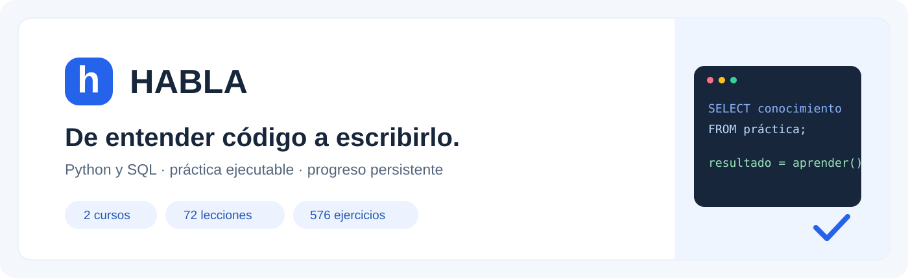
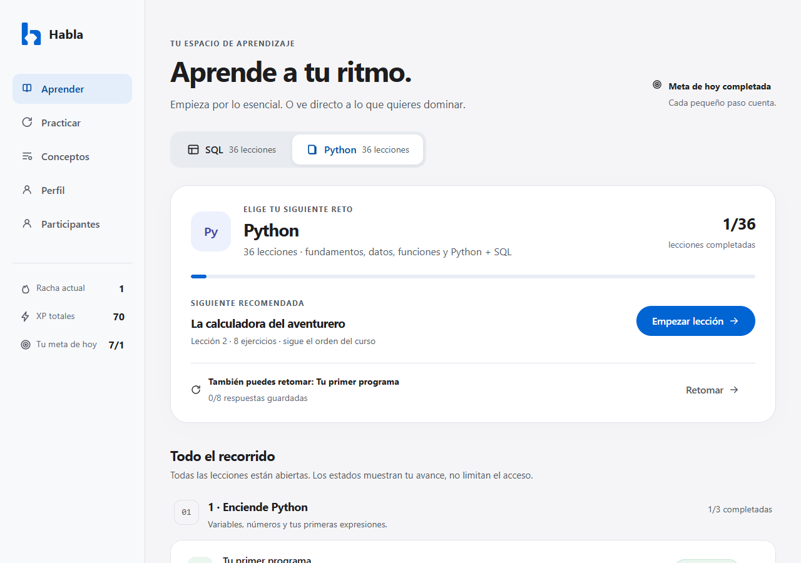
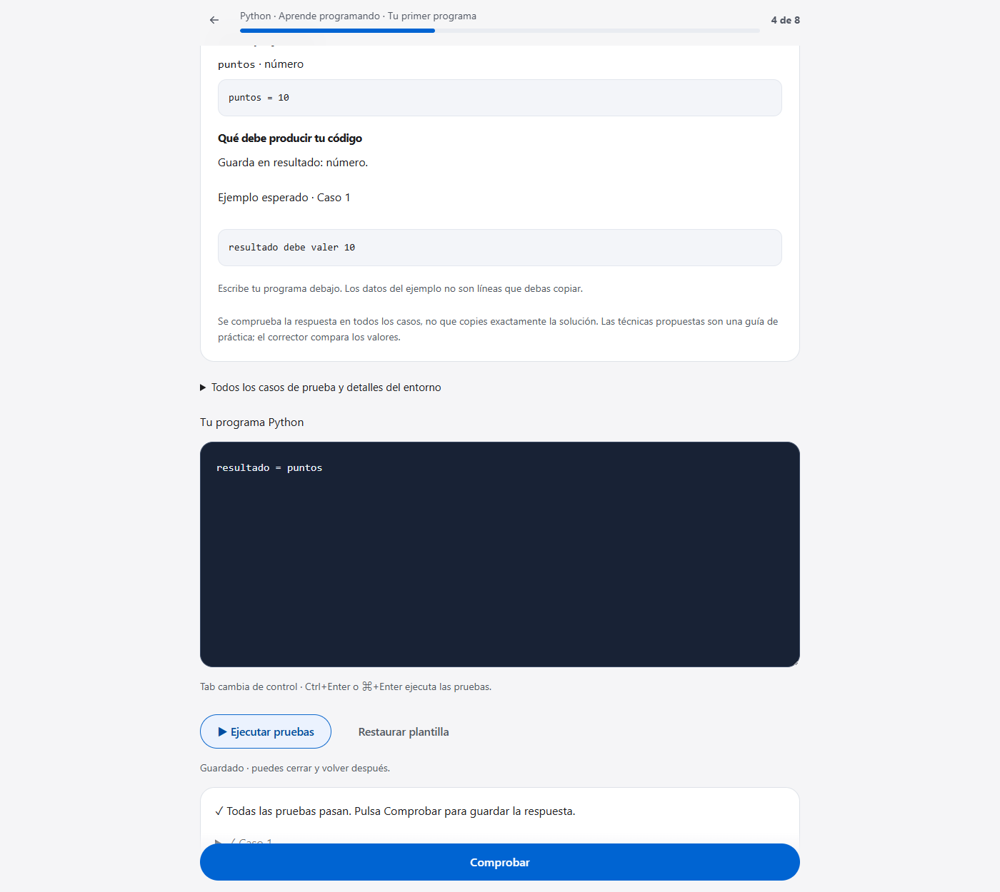
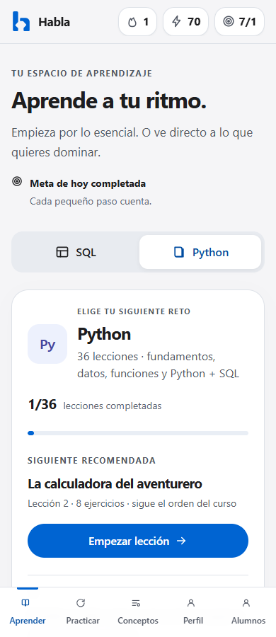

<p align="center">
  
</p>

<h1 align="center">HABLA</h1>

<p align="center"><strong>Aprende Python y SQL escribiendo, ejecutando y entendiendo tu código.</strong></p>

<p align="center">
  <a href="https://habla-python-sql.fernandino.chatgpt.site">Abrir la demo</a> ·
  <a href="docs/ARCHITECTURE.md">Arquitectura</a> ·
  <a href="docs/DEVELOPMENT.md">Ejecutar el proyecto</a> ·
  <a href="docs/PROJECT.md">Decisiones de producto</a>
</p>

<p align="center">A Spanish learning app for Python and SQL, with executable exercises, feedback, and persistent progress.</p>

[](https://github.com/fer-oconnor/habla/actions/workflows/ci.yml)





HABLA convierte el aprendizaje de programación en sesiones cortas y prácticas. El alumno elige una lección, descubre un concepto, escribe código sobre datos visibles, ejecuta pruebas y recibe una explicación del resultado. Puede avanzar en orden o ir directamente a lo que necesita, y retomar sus borradores desde otro dispositivo.

Este repositorio recoge la versión web final **HABLA Studio** y conserva, en [`local/`](local/), la edición de escritorio con servidor local. Incluye la aplicación, el currículo, los correctores, las migraciones y los controles de calidad. Los perfiles y las bases de datos reales no forman parte del repositorio.

## Ver el proyecto en dos minutos

1. Abre la [demo pública](https://habla-python-sql.fernandino.chatgpt.site) y entra con ChatGPT.
2. Elige **SQL** o **Python**. Todas las lecciones están disponibles desde el principio.
3. Abre una lección con editor y consulta **Datos de prueba y entorno**.
4. Usa **Ejecutar pruebas** para experimentar y **Comprobar** para registrar una respuesta y ver su explicación.
5. Vuelve al recorrido: verás tu avance, la siguiente lección recomendada y una opción independiente para retomar un intento reciente.

Para evaluar el código, empieza por [`app/backend.ts`](app/backend.ts), [`public/js/laboratory.js`](public/js/laboratory.js), [`public/code_runner.py`](public/code_runner.py) y las [decisiones de arquitectura](docs/ARCHITECTURE.md).

## Qué ofrece

| Aprendizaje | Continuidad | Experiencia |
| --- | --- | --- |
| Dos cursos independientes: Python y SQL | Respuestas y borradores persistentes | Interfaz en español adaptable a móvil y escritorio |
| **24 unidades · 72 lecciones · 576 ejercicios** | Retomar una lección sin empezar de cero | Navegación libre por todo el recorrido |
| **265 ejercicios con editor de código** | Mismo perfil web en distintos dispositivos | Datos de entrada, tablas y resultados esperados visibles |
| Corrección por comportamiento sobre varios casos | XP, metas diarias, rachas y logros | Repaso de errores y conceptos aprendidos |
| Soluciones y explicaciones tras comprobar | Progreso separado por usuario | Consentimiento opcional para compartir un resumen con el creador |

Las cifras corresponden al catálogo de [`app/curriculum.json`](app/curriculum.json). Cada lección contiene ocho ejercicios y se supera con seis aciertos. Superarla registra avance; el acceso a otras lecciones permanece abierto.

### Un laboratorio para aprender



En **Python**, el ejercicio proporciona entradas como variables y pide guardar la respuesta en `resultado`. En **SQL**, muestra el esquema y los datos de una base SQLite desechable. El corrector compara resultados: acepta implementaciones alternativas que cumplan el contrato del ejercicio, sin exigir copiar literalmente una solución.

El laboratorio web utiliza **Pyodide 0.29.2 y SQLite en un Web Worker** del navegador. El código del alumno no se ejecuta en el servidor ni accede a la base de datos del progreso. La primera carga requiere conexión al CDN y un navegador moderno con WebAssembly.

Este es un producto de autoaprendizaje: el servidor comprueba resultados reportados por el navegador, por lo que un usuario puede manipular sus propias respuestas. No está diseñado como sistema de evaluación certificada. Los límites de ejecución y lenguaje se detallan en [SECURITY.md](SECURITY.md).

## El recorrido

| SQL · 12 unidades, 36 lecciones | Python · 12 unidades, 36 lecciones |
| --- | --- |
| Selección, filtros y primeras consultas | Variables, tipos y cadenas |
| Agregaciones, `GROUP BY`, `HAVING` y `CASE` | Condicionales, bucles y colecciones |
| Relaciones, `JOIN` y transformación de datos | Diccionarios, conjuntos y funciones |
| Subconsultas, CTE y operaciones de conjuntos | Comprensiones, iteradores y generadores |
| Ventanas, rankings, acumulados y `LAG` | Excepciones, JSON y archivos de ejemplo |
| Tablas, transacciones, índices e informes | Clases, pruebas y proyectos con `sqlite3` |

El dialecto del laboratorio es **SQLite**. Las instrucciones distinguen los datos de entrada, el resultado requerido y las reglas de comparación, incluido cuándo importa el orden de las filas.

## Decisiones técnicas que merece la pena revisar

- **Ejecución en el navegador.** Python y SQL funcionan sin instalar Python en el dispositivo del alumno. Un Worker mantiene el trabajo del laboratorio separado de la interfaz y se termina cuando vence el límite de tiempo.
- **Persistencia con control de concurrencia.** D1 conserva el estado y los intentos. Las escrituras usan revisión optimista y un lote atómico para evitar sobrescribir borradores recientes o conceder XP dos veces entre dispositivos.
- **Identidad validada en el servidor.** La web usa la identidad que inyecta Sites tras entrar con ChatGPT. Cada intento se consulta junto a su propietario; un ID de intento por sí solo no autoriza su acceso.
- **Errores recuperables.** La lectura defensiva conserva campos recuperables. Un registro completamente ilegible no se sobrescribe. Cuando el guardado falla, se ofrece una ronda temporal sin XP ni sincronización posterior.
- **Reutilización de la interfaz.** La aplicación conserva módulos DOM en JavaScript y CSS propios, integrados mediante una capa React/Vinext. La web final y la edición local comparten conceptos y contenido, con adaptadores distintos para identidad, ejecución y almacenamiento.
- **Privacidad elegida por el alumno.** El panel del creador solo proyecta el resumen de quienes han elegido compartirlo. Excluye correos, respuestas y borradores; retirar el consentimiento no borra el progreso ni limita el curso.

La [arquitectura](docs/ARCHITECTURE.md) explica el flujo de una respuesta, el modelo de datos y los límites de estas decisiones.

## Dos ediciones, un proyecto

| | Web final · raíz del repositorio | Local · [`local/`](local/) |
| --- | --- | --- |
| Uso | Demo accesible desde distintos dispositivos | Práctica en el propio ordenador |
| Interfaz | HABLA Studio, navegación libre | Interfaz y flujo de la edición local |
| Servidor | Vinext sobre Cloudflare Workers / Sites | Express sobre Node.js, enlazado a loopback |
| Identidad | Inicio de sesión con ChatGPT gestionado por Sites | Invitados y cuentas locales; contraseñas con `scrypt` |
| Persistencia | Cloudflare D1 | Archivo SQLite `local/data/habla.db` |
| Python y SQL | Pyodide en un Worker del navegador | Proceso Python separado por ejecución |
| Conexión | Necesaria para identidad, API y primera carga del laboratorio | Sin servicios externos para practicar tras instalar requisitos |
| Progreso | Asociado a la cuenta en esta web | Asociado a esa instalación; no se sincroniza con la demo |

La edición local ejecuta código en el ordenador que la aloja y **no es un sandbox preparado para ofrecer ejecución arbitraria en internet**. Consulta [SECURITY.md](SECURITY.md) antes de cambiar su ámbito de uso.

## Ejecutarlo

### Web final

Necesita **Node.js 22.13 o superior**; se recomienda **Node.js 24**, la versión fijada en `.nvmrc` y usada en CI. Desde la raíz:

```sh
npm run install:ci
npm run build
node --import ./scripts/sites-env.mjs ./node_modules/wrangler/bin/wrangler.js d1 execute DB --local --config dist/server/wrangler.json --persist-to .wrangler/state --file drizzle/0000_cynical_cassandra_nova.sql
npm run dev
```

Abre la URL que indique el servidor; el puerto inicial del perfil portable es `5173`. En desarrollo sobre loopback, visita `/signin-with-chatgpt?return_to=/` para activar la identidad ficticia de pruebas. No necesitas credenciales de una cuenta real para esa vista previa.

Aplica la migración una sola vez a una base nueva. El despliegue público requiere el entorno de Sites que proporciona autenticación y D1; un despliegue genérico debe implementar esa integración. [Guía completa de desarrollo](docs/DEVELOPMENT.md).

### Edición local

Necesita **Node.js 22.13 o superior** —se recomienda **24**—, **Python 3.11 o superior con SQLite** y las dependencias de `local/package.json`:

```sh
cd local
npm ci
npm run setup
npm start
```

Abre `http://localhost:3000`. Si Python no está en el `PATH`, configura `PYTHON_BIN` en `local/.env`. `setup` crea o actualiza el catálogo conservando los perfiles existentes.

## Calidad y alcance

El proyecto incluye pruebas de autenticación, aislamiento entre usuarios, corrección, persistencia, flujo de lecciones, repasos y rachas para la edición local. La web incluye comprobaciones del catálogo completo, autorización del creador, registros dañados, continuidad de borradores, idempotencia y flujos de navegador.

```sh
npm test                 # Web: catálogo, sintaxis, acceso y autorización del creador
npx playwright install chromium
npm run test:browser     # Web: controles del navegador en serie, sobre vista previa local
cd local
npm test                 # Autenticación, aislamiento, corrección y persistencia
npm run verify:curriculum
```

Las pruebas de navegador requieren la web de desarrollo y su base local preparadas. Usan `http://127.0.0.1:5173` por defecto; `HABLA_TEST_URL` permite otro origen de loopback. Los scripts rechazan direcciones de producción. Consulta las [opciones de navegador](docs/DEVELOPMENT.md#verificación).

Verificado antes de publicar: instalación desde los lockfiles, compilación web, controles de API y los cuatro flujos de navegador. El laboratorio pasó sus **265 modelos con editor** y las **14 alternativas de corrección**. La edición local pasó **79 pruebas**, además de validar **198 programas y 596 casos**. [Entorno y resultados de verificación](docs/DEVELOPMENT.md#verificación-de-la-publicación).

Los controles de navegador incluyen teclado, contraste sobre fondos sólidos y anchos entre 320 y 1920 px. Su alcance no equivale a una auditoría completa de accesibilidad, pruebas en dispositivos físicos o una auditoría de seguridad independiente. No se presentan métricas de uso, conversión ni resultados educativos que no se hayan medido.

<p align="center"></p>

## Mapa del repositorio

```text
app/                  API, capa React y currículo final
public/js/            Interfaz modular, editor y laboratorio del navegador
public/code_runner.py Corrector Python / SQLite para Pyodide
db/ + drizzle/        Esquema D1 y migración
scripts/              Instalación, compilación y controles de calidad
local/                Edición Express + SQLite + Python local
docs/                 Arquitectura, desarrollo, producto y capturas reales
SECURITY.md           Modelo de confianza y límites de ejecución
```

Para entender la evolución del producto y los compromisos asumidos, consulta [Proyecto y decisiones](docs/PROJECT.md).

Proyecto de portfolio de [fer-oconnor](https://github.com/fer-oconnor). Licencia [MIT](LICENSE); el starter y los componentes de terceros se reconocen en [THIRD_PARTY.md](THIRD_PARTY.md) y conservan sus propias licencias.
