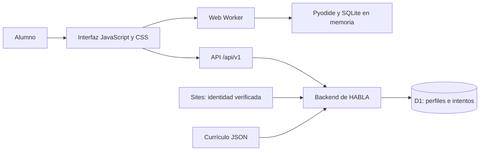
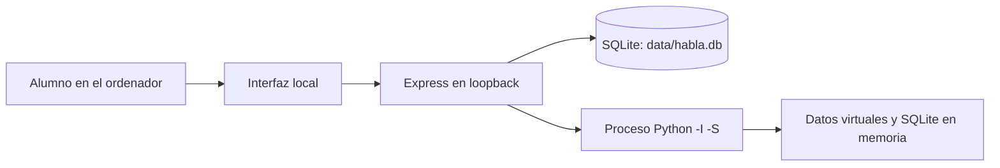

# Arquitectura de HABLA

La versión final combina una interfaz modular de JavaScript con un backend para Cloudflare Workers, persistencia D1 y un laboratorio Python/SQLite ejecutado en el navegador. La edición local queda en `local/` como una implementación alternativa con Express, SQLite y procesos Python.

## Vista general de la web final

La capa React de [`app/habla.tsx`](../app/habla.tsx) monta la estructura de la aplicación y carga el punto de entrada DOM. Los módulos de `public/js/views/` renderizan las vistas y `public/js/api.js` centraliza las peticiones. Vinext integra esa capa con el entorno de Cloudflare y el enrutado de la API.

El diseño conserva el frontend del proyecto y adapta sus servicios. No convierte cada vista en un componente React. Esta decisión permitió mantener la interacción del editor y reutilizar los flujos de aprendizaje; implica cuidar explícitamente el ciclo de vida, los listeners y el estado del router DOM.

## Cómo se comprueba una respuesta de código

1. El backend devuelve el ejercicio, sus casos de prueba y los resultados de referencia precalculados. El currículo define el contrato visible al alumno.
2. **Ejecutar pruebas** guarda el borrador cuando el almacenamiento está disponible y solicita la ejecución a `public/js/laboratory.js`.
3. El módulo serializa las ejecuciones y envía el trabajo a `public/js/code-worker.js`. El Worker carga Pyodide y el corrector `public/code_runner.py`.
4. Python recibe las entradas del caso y devuelve `resultado`; SQL usa una base SQLite desechable y devuelve columnas y filas. El corrector restringe construcciones, importaciones, atributos, tamaños y operaciones SQLite.
5. La interfaz compara los resultados y muestra el detalle de cada caso. Un tiempo máximo termina el Worker si la ejecución no finaliza.
6. **Comprobar** envía la respuesta y los resultados al backend. El backend compara lo reportado con las referencias, registra la respuesta y devuelve solución y explicación.

El servidor no ejecuta código del alumno. Los casos y resultados reportados pertenecen al cliente, de modo que una persona puede alterar sus propias respuestas. Este modelo sirve para autoaprendizaje; no demuestra autoría ni es adecuado para exámenes certificados.

La comparación Python utiliza una representación canónica del valor de `resultado`. SQL comprueba nombres de columnas y filas; si el contrato no exige orden, las filas se ordenan para compararlas. La ejecución SQL del alumno nunca toca la base D1.

## Currículo como datos

[`app/curriculum.json`](../app/curriculum.json) es el catálogo final publicado: dos cursos, 24 unidades, 72 lecciones, 576 ejercicios y 265 ejercicios con editor. Contiene instrucciones, casos, explicaciones y referencias. Los IDs estables relacionan catálogo, intentos y progreso.

La navegación web permite acceder a cualquier lección. El estado de una lección indica avance, sin funcionar como una autorización o un bloqueo. La siguiente recomendada es la primera pendiente según el orden del curso; el intento reciente que puede retomarse se calcula por separado.

Los módulos `local/db/content/` contienen las fuentes del currículo de la edición local. Los scripts de exportación y revisión de la web preparan la versión publicable sin consultar perfiles reales. La exportación es una operación de desarrollo; no es necesario ejecutarla para iniciar el currículo final incluido.

## Persistencia y concurrencia

El esquema D1 tiene dos tablas principales:

| Tabla | Responsabilidad |
| --- | --- |
| `learners` | Identidad del alumno, estado JSON de perfil/progreso, revisión, token de escritura y fecha de actualización |
| `attempts` | Propietario, lección, estado y datos JSON del intento, incluidas respuestas y borradores |

`learners.state` agrupa preferencias, progreso por lección, actividad diaria, vocabulario, repasos, logros y XP. Mantener el estado reunido facilita trasladar la lógica de la edición local, a costa de un modelo menos normalizado para consultas analíticas.

Cada mutación lee una revisión, calcula el siguiente estado y ejecuta un lote D1 atómico. La actualización del perfil exige que la revisión siga siendo la misma. Un token único condiciona la escritura del intento a que esa actualización haya ocurrido. Si otro dispositivo escribió primero, la operación vuelve a leer y reintenta, con un máximo de cinco intentos.

El procesamiento de respuestas y finales también reconoce operaciones repetidas. La intención es conservar el borrador más reciente y evitar recompensas duplicadas por reenvíos o concurrencia. Los conflictos agotados devuelven un error recuperable, sin reemplazar silenciosamente el progreso más nuevo.

El almacenamiento del navegador conserva preferencias y una copia temporal del borrador pendiente. **D1 es la fuente de verdad del progreso web.** Cerrar la pestaña no es un mecanismo de sincronización; el guardado debe completarse a través de la API.

## Identidad y acceso

Sites gestiona el inicio de sesión con ChatGPT e inyecta las cabeceras verificadas de identidad. El backend usa el ID estable de ese usuario para los registros; el correo es información de perfil, sin funcionar como clave de autorización.

Las consultas de intentos incluyen `id` y `user_id`. Las escrituras comprueban origen y rechazan peticiones de otros sitios. La confianza en las cabeceras depende de ejecutar la aplicación detrás del servicio de Sites: un host genérico no debe aceptar cabeceras de identidad enviadas libremente por el cliente.

El panel `/admin` requiere que la identidad verificada coincida con el secreto `HABLA_OWNER_USER_ID`. Si falta esa configuración, el acceso se rechaza. La aplicación no infiere privilegios a partir del nombre, del correo, del navegador ni de campos modificables del perfil.

Solo se muestran participantes con una elección afirmativa de compartir y la versión vigente del aviso. La consulta proyecta nombre de perfil, avance, aciertos, XP y última actividad, sin cargar correos, respuestas o borradores para el panel. El consentimiento puede retirarse desde Perfil.

## Fallos y recuperación

- **Estado parcialmente inválido:** la lectura completa campos necesarios con valores seguros y conserva los datos recuperables originales dentro del registro privado antes de una escritura posterior.
- **JSON completamente ilegible:** no se sobrescribe el registro. El contenido del curso sigue accesible y la interfaz informa de la falta de progreso.
- **Almacenamiento no disponible:** se puede abrir una práctica temporal con el mismo corrector. No se concede XP ni se sincronizan posteriormente sus resultados.
- **API sin conexión:** las respuestas normales no pueden corregirse mediante el servidor. La web no promete funcionamiento completamente sin conexión.
- **Laboratorio bloqueado:** se termina el Worker al vencer el tiempo, y la próxima ejecución vuelve a inicializar el entorno.

## Edición local

Las rutas y servicios locales separan autenticación, intentos, corrección y progreso. Las sesiones viven en SQLite y las contraseñas usan `scrypt` con sal aleatoria y parámetros guardados. Un invitado puede convertirse en cuenta local conservando su ID y su avance.

El adaptador de base usa la dependencia opcional `better-sqlite3` y recurre a `node:sqlite` si el módulo nativo no está disponible. La edición requiere Node.js 22.13 o superior; se recomienda Node.js 24. Los servicios trabajan sobre una interfaz común de consultas y transacciones, con el mismo archivo SQLite en ambos casos.

Cada evaluación crea un proceso Python independiente con tiempo máximo, límite de salida y restricciones del lenguaje. Esas restricciones reducen riesgos accidentales; no convierten el servidor local en un entorno de aislamiento resistente frente a atacantes de internet. La copia publicada escucha en loopback. Los perfiles locales y web son independientes y no incluyen migración automática entre ellos.

## Límites asumidos

El backend web conserva lógica concentrada en `app/backend.ts` y utiliza `@ts-nocheck`; TypeScript no verifica íntegramente ese módulo. Los controles de comportamiento son especialmente relevantes aquí. Pyodide añade una descarga inicial y limita la compatibilidad a navegadores con WebAssembly. D1 y la autenticación dependen del entorno de alojamiento. La edición local muestra una arquitectura distinta, pero no es una réplica completa de la experiencia Studio final.

Consulta [Desarrollo](DEVELOPMENT.md) para reproducirlo y [Seguridad](../SECURITY.md) para el modelo de confianza.
